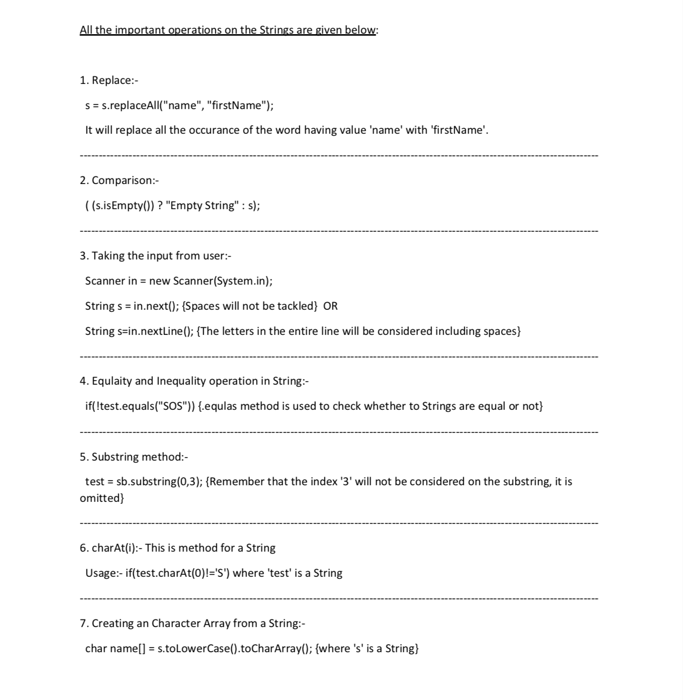
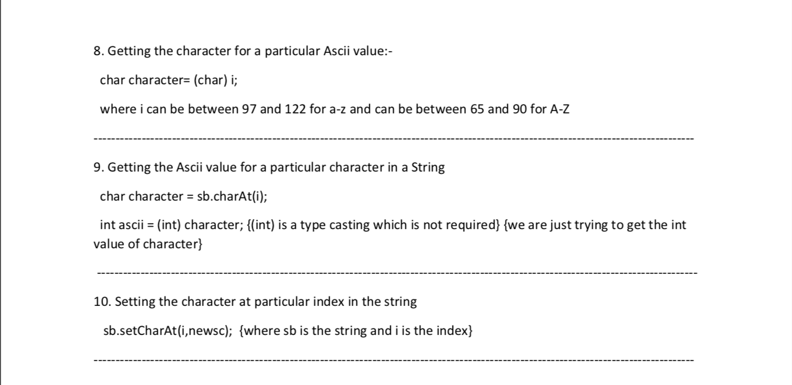
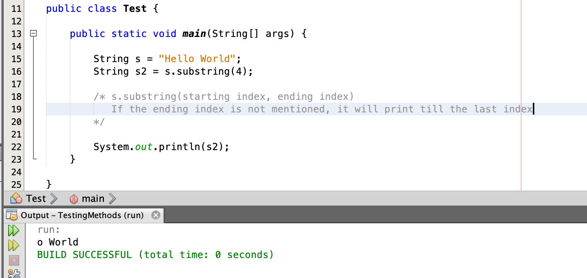
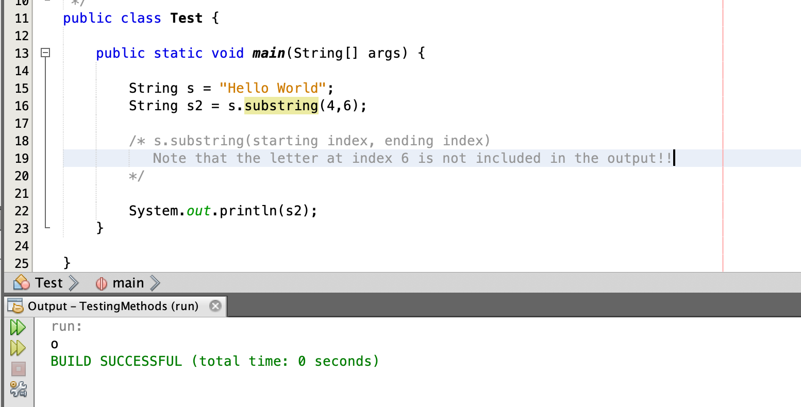

# SB255-Strings
Everything about Strings, from String arrays to String methods

How to Initialize String arrays and all the methods that are used in Strings for solving algo questions. 

## Some useful methods used for String operations are:  

---------------------------------------------------------------------------------------------
 
  

---------------------------------------------------------------------------------------------

## Some useful String operations:  
 
### String's substring method:
 

  

 
---------------------------------------------------------------------------------------------
### String's substring method:
 

  

---------------------------------------------------------------------------------------------

